# 2025's Top 13 Best AI Video Subtitle Tools

Getting your video seen is one thing—getting it watched with the sound off is another battle entirely. Something like 85% of social media videos play on mute, which means if you're not adding captions, you're basically talking to yourself while everyone scrolls past. AI subtitle tools solve this by automating what used to take hours of manual typing and syncing, turning speech into text in seconds while letting you customize fonts, add emojis, and translate into dozens of languages. Whether you're cranking out TikToks, recording podcasts, or building a YouTube channel, the right subtitle generator keeps your content accessible, engaging, and actually watchable without headphones.

***

## **[Capte](https://getcapte.com)**

French AI-powered video subtitle platform optimized for social media creators with automatic translation and style customization.

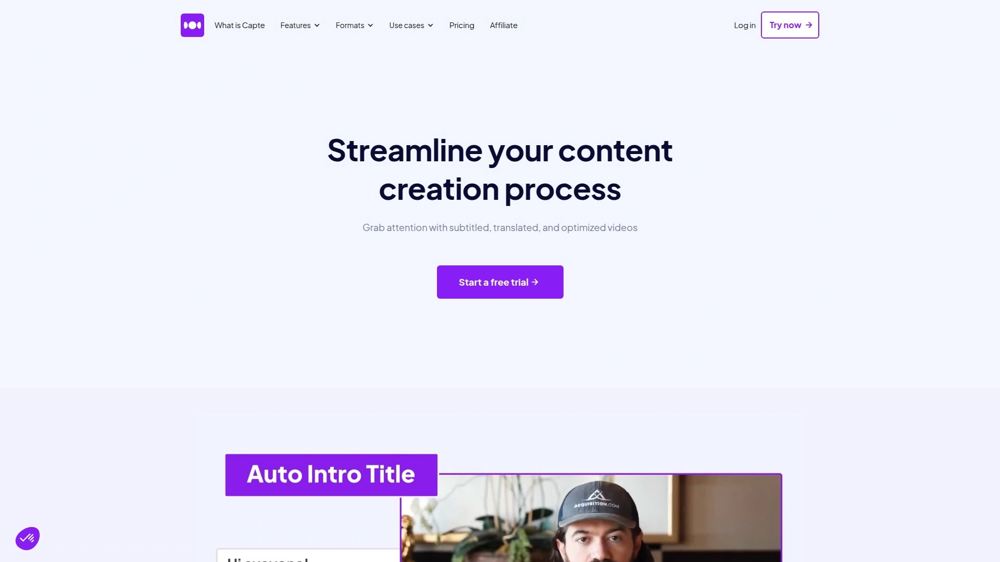

Capte generates AI subtitles for your videos in seconds using speech recognition technology that converts spoken words into timed captions automatically. The platform focuses specifically on short-form social media content, helping influencers and digital marketers create captivating videos optimized for platforms like TikTok, Instagram Reels, and YouTube Shorts.

**Style and customization depth:** Beyond basic captions, Capte offers extensive subtitle styling with themes, effects, emojis, fonts, and animations that make text pop visually. The "Magic Emojis" feature automatically inserts relevant emojis into subtitles based on context, adding personality without manual work. Pre-made themes give you one-click professional styling, while safezones ensure critical content stays visible across different platform aspect ratios.

Automatic translation converts subtitles into multiple languages, expanding your content's reach to international audiences without hiring translators. The platform handles video export in Full HD and 4K without quality loss, ensuring your final product looks professional. Capte even generates social media post suggestions based on your video content, streamlining the entire publishing workflow.

Pricing starts at $7 monthly for the Starter plan (10 minutes per video, 200MB max), scales to $20 monthly for Standard (automatic translation, 35 minutes per video, 1GB max), and reaches $50 monthly for Premium (120 minutes per video, 5GB max, priority support). The platform serves thousands of French-speaking creators who praise its simplicity and effectiveness.

***

## **[Submagic](https://www.submagic.co)**

Viral short-form video specialist with 98.8% subtitle accuracy, auto B-roll insertion, and 28 customizable caption styles.

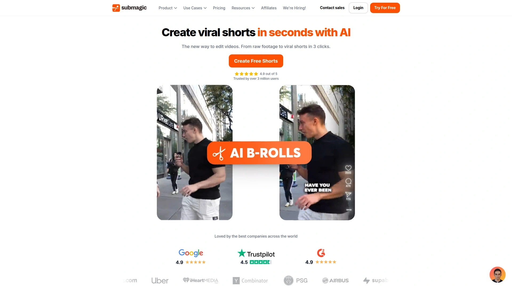

Submagic positions itself as the go-to tool for creating captivating short videos that actually go viral, used by teams and businesses to transform raw footage into polished social content in seconds. The platform achieves 98.8% accuracy for subtitle transcription using advanced AI, meaning you spend less time fixing errors and more time creating. With 28 preset caption styles including trendy formats like "Daniel," "Hormozi," and "Leon" styles, you can match whatever's currently working on TikTok or Instagram without starting from scratch.

Auto B-roll automatically adds royalty-free footage or lets you import your own clips in one click, solving the problem of static talking-head videos that lose viewer attention. Auto transitions create smooth cuts between B-roll clips with animated emojis and sound effects, while auto zoom generates dynamic camera movements that make even simple recordings feel professionally edited. Auto cut removes all silence from videos automatically, eliminating the tedious manual trimming that eats up editing time.

Beyond captions, Submagic generates video descriptions and hashtags optimized for social media algorithms, plus extracts the best moments from longer content with its Magic Clips feature. The platform supports subtitle generation in 48 languages, making it versatile for global content strategies. Manual editing tools let you adjust timings, correct words, and perfect punctuation for 100% accuracy when AI misses nuances.

***

## **[VEED.io](https://www.veed.io)**

Browser-based video editor with 99.9% accurate auto-subtitles, no downloads required, and collaborative team features.

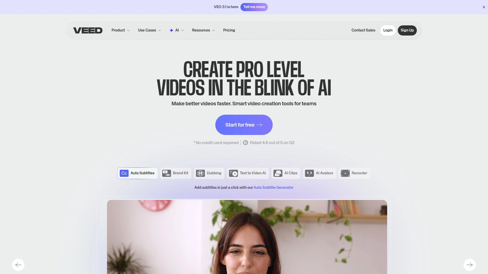

VEED operates entirely in your browser, meaning you're editing seconds after opening the page rather than waiting for software downloads and installations. The auto subtitle generator delivers 99.9% accuracy across multiple languages, automatically transcribing speech and burning captions directly into widescreen, square, and vertical video formats. This accuracy level reduces manual correction time dramatically compared to tools that force you to rewrite half the transcript.

Cloud-based access means you can start editing on your laptop, continue on a tablet, and finalize on any device with an internet connection. Collaborative features let teams work on projects simultaneously, perfect for agencies managing multiple clients or brands with distributed creative teams. The platform includes a comprehensive library of stock videos, images, audio, and visual elements free to use, eliminating the need for separate stock footage subscriptions.

One-touch resizing adapts videos for different social platforms automatically, converting 16:9 YouTube videos to 9:16 TikTok format or 1:1 Instagram posts without manual cropping. Beyond subtitles, VEED offers complete video editing tools including trimming, splitting, filters, transitions, and text overlays. The free version includes watermarks, while paid plans starting around $12-24 monthly remove branding and unlock advanced features.

***

## **[Kapwing](https://www.kapwing.com)**

Free online video editor with automatic subtitles, templates, and collaboration tools—no credit card required to start.

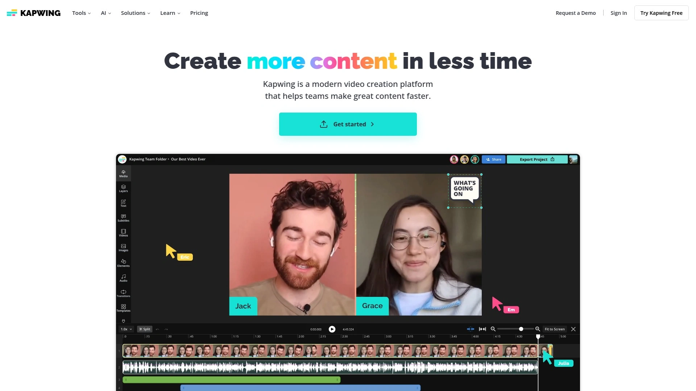

Kapwing removes the barrier to entry by offering genuinely useful free features including automatic subtitle generation, making it accessible for creators testing video content before committing budget. The platform provides free automatic subtitles that you can customize to match your video's style, then easily adjust placement and timing. Free users also get access to templates, stock media, and collaborative editing features, though exports include a watermark.

The subtitle generator supports over 60 spoken languages, handling everything from English and Spanish to less common languages without requiring separate tools. Customization options let you change fonts, colors, sizes, positioning, and animations to match your brand rather than looking like every other auto-captioned video. Style templates save your customization choices for instant application to future videos, streamlining repetitive editing workflows.

Video editing features extend beyond captions to include resizing, trimming, audio editing, text overlays, image overlays, background removal, and screen recording—essentially a complete video production suite. The interface emphasizes ease of use with drag-and-drop functionality and intuitive controls accessible to beginners. Performance can lag with large video files, and some advanced features require paid plans, but the free tier provides genuine value rather than just a trial.

***

## **[CapCut](https://www.capcut.com)**

TikTok's official video editor offering free AI auto-captions, 26+ animated templates, and mobile-first editing optimized for social platforms.

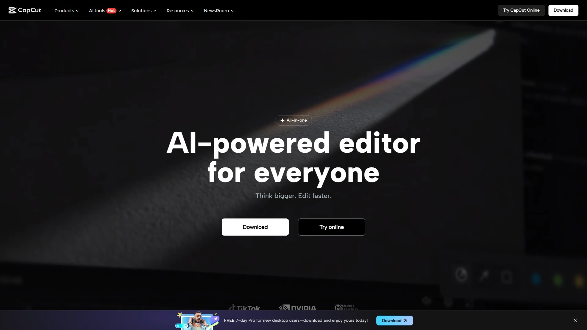

CapCut dominates the social media creator space as TikTok's official editing app, used by millions who prioritize quick mobile editing and platform-specific optimization. The free version genuinely includes AI-generated captions with high accuracy plus 26+ customizable animated subtitle templates designed specifically for short-form viral content. Unlike platforms that paywall their best features, CapCut provides professional-grade tools at no cost, making it the go-to choice for creators just starting out.

Mobile-first design means the app feels natural on smartphones with touch-optimized controls, perfect for creators shooting and editing entirely on their phones. Desktop versions offer more screen real estate and advanced editing features while maintaining the same intuitive workflow. Speed controls include standard adjustment plus curve-based velocity changes that create dramatic slow-motion or time-lapse effects with smooth transitions.

The platform excels at TikTok-specific optimization with built-in templates matching current trends, aspect ratio presets for Reels and Shorts, and effects aligned with what's performing well algorithmically. Visual effects library includes filters, transitions, stickers, animations, and green screen capabilities that rival paid professional software. Limitations include occasional accuracy issues with captions requiring manual correction and performance constraints with very large video files.

***

## **[Descript](https://www.descript.com)**

Text-based video editor revolutionizing workflows by letting you edit videos like documents—cut words, not timelines.

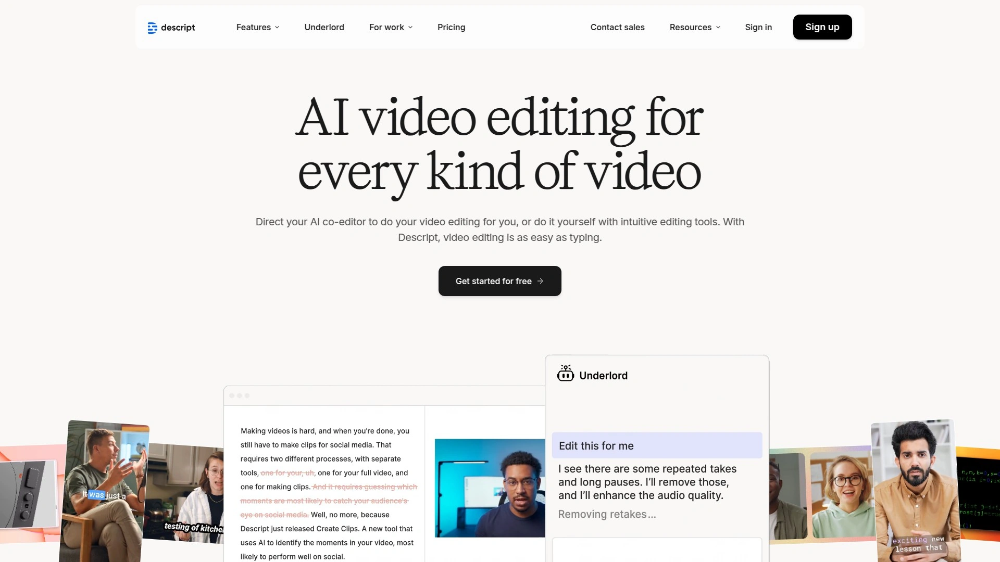

Descript invented the text-based editing paradigm that changed how creators approach video production: edit the transcript and the video updates automatically. If you know how to use backspace or copy-paste, you already know how to edit video in Descript—no timeline scrubbing or frame-perfect cuts required. This approach cuts editing time dramatically, with users reporting 2-hour podcast edits that previously took 8+ hours manually.

**Underlord AI assistant** scans your video to identify the most viral-worthy moments, then automatically clips them, formats them for social platforms, adds captions, and prepares them for publishing. This transforms one long recording into a full week of social media content without manual clip hunting. Voice cloning technology creates a realistic AI version of your voice to fix mistakes or generate new content without re-recording, saving hours when you notice errors after filming.

Studio-quality tools handle podcast and video production with built-in noise removal, auto-leveling, multitrack editing, and screen recording capabilities. Filler word removal automatically deletes "ums," "ahs," and awkward pauses with one click rather than tedious manual cutting. Collaboration features sync projects in the cloud for real-time team editing, making it powerful for agencies and distributed creative teams.

Pricing starts at $24 monthly for Hobbyist, $35 for Creator, and $65 for Business plans, with yearly billing reducing costs. Some users report memory intensity causing crashes on less powerful computers, and transcription accuracy struggles with heavy accents requiring manual cleanup.

***

## **[OpusClip](https://www.opus.pro)**

AI video clipping engine turning hour-long content into viral shorts in under 30 seconds with 0.93 mAP accuracy.

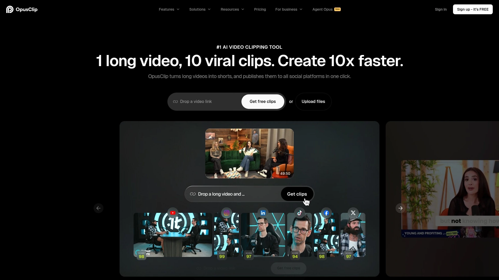

OpusClip leads the market in AI-powered highlight detection accuracy, achieving 0.93 mean Average Precision (mAP) compared to competitors ranging 0.72-0.88. The ClipAnything engine evaluates visual changes, audio clarity, transcript keyword density, and learned patterns to rank segments by viral potential rather than just identifying any random moment. This precision means the AI actually finds your best clips instead of dumping 50 mediocre options for you to sort through manually.

Processing speed makes OpusClip practically instant—hour-long videos get analyzed and clipped in under 30 seconds compared to 2-15 minutes for competing tools. This speed matters when you're processing multiple videos weekly or trying to capitalize on trending topics before they pass. The auto video editor includes manual override tools so you can adjust timestamps and save changes as training data, improving future AI performance for your specific content style.

OpusClip focuses specifically on creating short clips from long-form content, making it ideal for podcasters and YouTubers repurposing episodes into TikToks, Reels, and Shorts. The platform automatically formats clips for different aspect ratios, adds captions, and applies trending visual styles. Unlike Descript's comprehensive editing suite, OpusClip specializes in one thing and does it exceptionally well—finding viral moments fast.

***

## **[HappyScribe](https://www.happyscribe.com)**

AI transcription and subtitling platform supporting 120+ languages with 85-95% automatic accuracy or 99% human-made service option.

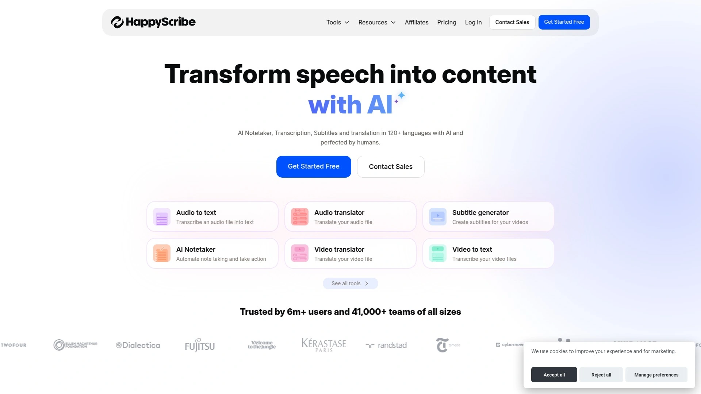

HappyScribe delivers automatic subtitle generation with 85-95% accuracy depending on audio quality, using advanced speech recognition across 120+ languages and dialects. This broad language support makes it valuable for international content creators and businesses serving diverse markets. Unlike tools offering only AI transcription, HappyScribe provides professional human-made subtitling services delivering 99% accuracy in under 24 hours for quality-critical projects.

The platform supports 60+ video formats including MP4, MOV, and AVI, letting you import from your computer, Google Drive, Dropbox, or YouTube without conversion hassles. Interactive text editor syncs transcripts with audio playback—click any word to hear the corresponding audio, making verification and editing straightforward. Speaker labels, timestamps, and collaborative editing features support team workflows for journalism, academic research, and business documentation.

Subtitle customization includes adjusting timing, fonts, colors, animations, and export formats like SRT, VTT, STL, and formats compatible with Final Cut Pro, AVID, and Premiere. Pay-as-you-go pricing starts with limited free minutes for testing, then $17 monthly for Basic (120 minutes), $29 monthly for Pro, and $49 monthly for Business (600 minutes). Users praise the balance of accuracy and affordability, noting it handles even challenging languages like Tamil at 65-75% accuracy requiring manageable manual cleanup.

***

## **[Rev](https://www.rev.com)**

Professional transcription service offering 95%+ AI accuracy across 38 languages or 99%+ human transcription with Rush turnaround option.

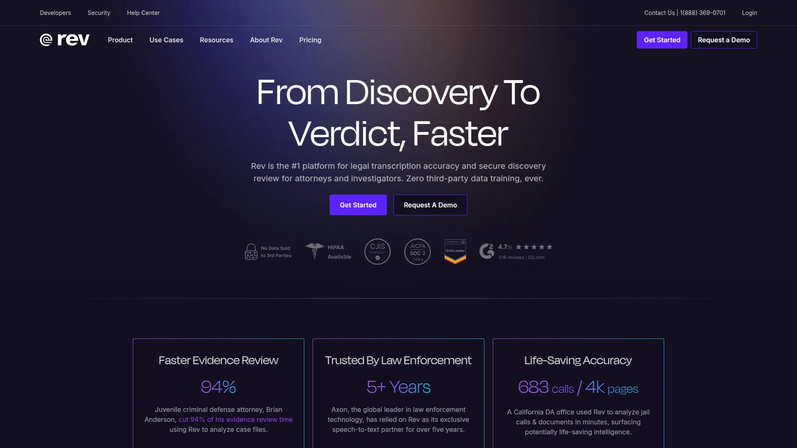

Rev separates itself through dual-track service: AI transcription at 95%+ accuracy for clean audio or human transcription at 99%+ for complex recordings requiring absolute precision. This flexibility lets you choose speed and cost-effectiveness for routine content while escalating to human experts for critical material like legal proceedings, medical recordings, or academic research. Independent ASR studies from July 2024 demonstrated Rev's AI outperforming competitors by significant margins across various environments including noisy backgrounds and multiple speakers.

Rush service provides faster turnaround times when you're working against deadlines, delivering professional transcriptions in hours rather than days. The human transcription service handles challenging audio scenarios including heavy accents, technical jargon, overlapping speakers, and poor recording quality that trips up pure AI solutions. Support for 38+ languages with AI and extensive language coverage for human services makes Rev suitable for global operations.

Rev.ai's API delivers transcription at just 0.3¢ per minute with no hidden fees, making it exceptionally affordable for high-volume needs. Developer-friendly documentation includes code samples in Python, Java, C#, JavaScript, and other popular languages plus SDKs for iOS and Android. Volume discounts available for large-scale operations, with transparent pricing rather than forcing contact-for-quote enterprise models.

***

## **[Zubtitle](https://zubtitle.com)**

Straightforward social media video optimizer automatically adding burned-in captions with custom branding in minutes.

Zubtitle simplifies social media video optimization through state-of-the-art software that adds captions, headlines, and branding in minutes rather than hours. The platform costs less than half the price of hiring a virtual assistant to caption and edit videos, making professional results accessible to solo creators and small teams. Simple workflow involves uploading your video, selecting language, watching AI transcribe and caption automatically, then styling with custom fonts and colors.

Burned-in captions (open captions) embed text directly into widescreen, square, and vertical videos, ensuring captions display on any platform regardless of viewer settings. This matters because many social platforms default to muted playback, and burned-in captions work universally unlike closed captions requiring manual activation. Automatic transcription supports 60+ spoken languages, eliminating tedious manual typing for international content.

Brand consistency features let you save style templates using your specific fonts and colors, then apply them instantly to future videos. Built-in text editor adds video headlines that tease content and grab attention in crowded feeds. Caption animations add visual flair, while quick tools crop and resize videos to match any social platform's aspect ratio requirements. Trim functionality highlights the most attention-grabbing portions of longer recordings, and drag-and-drop logo placement adds watermarks with a couple of clicks.

***

## **[Pictory](https://pictory.ai)**

Text-to-video platform turning blog posts and scripts into complete videos with AI-selected stock footage and automatic captions.

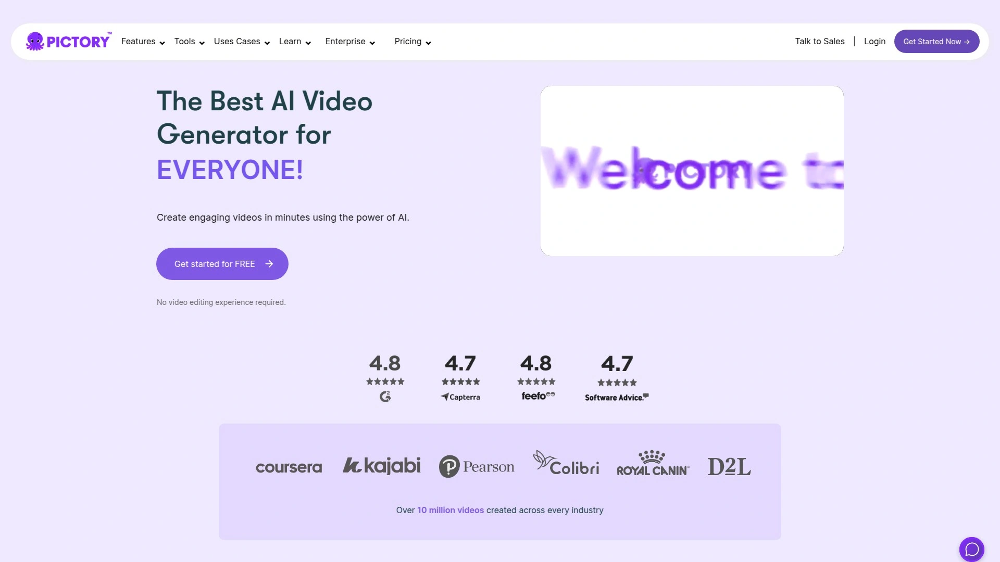

Pictory transforms written content into visual videos, making it fundamentally different from tools that just add captions to existing footage. Paste an article or script and Pictory generates an entire video by selecting relevant stock footage, adding voiceover, inserting transitions, and creating captions automatically. This approach works well for content marketers repurposing blog posts into video format and educators creating visual lessons from text materials.

The platform's effectiveness depends heavily on available stock footage matching your topic—niches with abundant stock assets (business, technology, lifestyle) work better than specialized technical subjects. You're at the mercy of what stock libraries contain, though Pictory's AI does a reasonable job selecting contextually relevant clips. Scene duration and timing are adjustable, letting you control pacing and emphasis.

Pictory suits users creating videos from scratch rather than those editing existing recordings, positioning it differently from tools like Descript or OpusClip. The platform handles subtitle generation as part of its complete video creation workflow rather than as a standalone feature. User-friendly interface makes it accessible to beginners with no video editing experience, though results may feel generic compared to custom-shot footage.

***

## **[Clipchamp](https://clipchamp.com)**

Microsoft's video editor included free with Windows, offering automatic subtitles across 100+ languages with AI video creation tools.

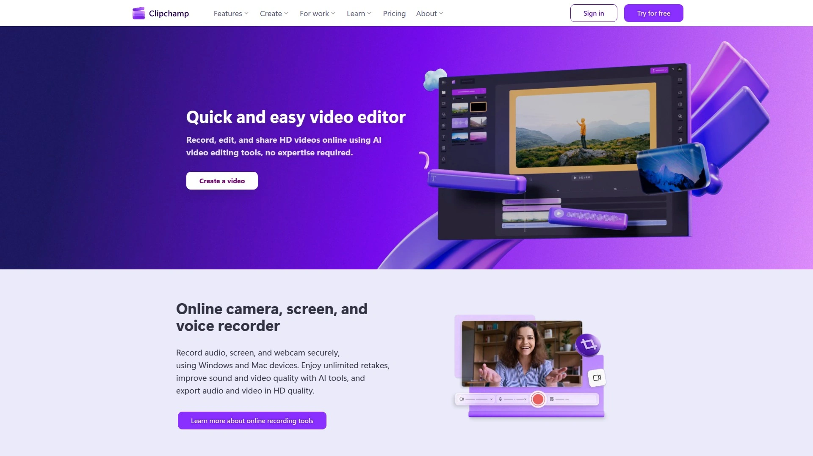

Clipchamp comes pre-installed on Windows 11 and integrates directly with Microsoft 365 subscriptions, giving millions of users immediate access without downloading separate software. The free version includes automatic subtitle generation in over 100 languages, making it genuinely useful rather than just a trial. Microsoft 365 Business Standard, Business Premium, E3, and E5 plans include Clipchamp Standard features at no additional cost, providing significant value for organizations already invested in the Microsoft ecosystem.

Auto subtitle generator creates engaging and accessible videos across any language, with customization options for fonts, colors, and positioning. Premium plans unlock 4K exports, brand kits with company-specific fonts and logos, premium stock content, and advanced analytics through Microsoft Stream integration. Pricing starts at $3 monthly for Standard standalone, with Premium at $10 monthly after introductory pricing or included with Copilot licenses.

Integration with Microsoft Stream provides video-level metrics tracking user behavior and performance, helping teams refine content strategies. Collaboration features sync with Microsoft Teams and SharePoint, keeping video projects within existing enterprise workflows. The platform targets business users creating training materials, presentations, and internal communications rather than social media creators, though it handles that use case adequately.

***

## **[ZapCap](https://zapcap.ai)**

Budget-friendly auto-captioning software generating precise captions in under one minute with 50+ language support.

ZapCap positions itself as the best video captioning tool through AI-powered precision that feels almost magical in speed—captions generated in less than 60 seconds. The platform attracts creators, marketers, and businesses through versatility and accuracy at accessible price points. Multi-language subtitle support covers 50+ languages, making it suitable for international content distribution without managing multiple tools.

Auto B-roll selection analyzes audio content and automatically inserts relevant supplemental footage, addressing the common problem of static talking-head videos losing viewer engagement. AI-powered sound effects and transitions enhance production value automatically without requiring manual audio engineering skills. Real-time caption generation and editing let you see and adjust results immediately rather than waiting for batch processing.

Web-based editor works on all devices without software installation, enabling editing from laptops, tablets, or smartphones. User-friendly interface emphasizes simplicity with efficient automation handling technical complexity behind the scenes. The platform supports customizable workflows and integrates with popular tools, though specifics depend on your plan tier. Reliable customer support helps troubleshoot issues quickly, and the free plan provides enough features to test whether ZapCap matches your workflow before upgrading.

***

## FAQ

**Do AI subtitle generators work well with accents and background noise?**

Accuracy varies significantly across tools and scenarios. Rev achieves 95%+ accuracy even with noisy backgrounds and accents through superior AI training, while most tools like HappyScribe and VEED deliver 85-95% accuracy on clean audio but struggle with heavy regional accents requiring manual cleanup. Descript users specifically note transcription struggles with non-neutral accents like Scottish, sometimes requiring 50%+ manual correction. For challenging audio, consider services offering human transcription options like Rev (99% accuracy) or HappyScribe's human-made service rather than relying solely on AI.

**Which subtitle tool works best for TikTok and Instagram Reels?**

CapCut dominates short-form social media as TikTok's official editor, with templates specifically designed for viral trends, platform-optimized aspect ratios, and effects matching what's currently performing well algorithmically. Submagic runs a close second with 28 preset caption styles including trendy formats like "Daniel" and "Hormozi" styles popular on Instagram, plus auto B-roll and transitions creating dynamic content that holds attention. Both handle mobile-first editing naturally, though CapCut offers more features completely free while Submagic charges for advanced automation.

**Can I translate subtitles automatically into multiple languages?**

Most modern platforms support automatic translation, though implementation varies. Capte and HappyScribe offer robust translation features converting subtitles into dozens of languages automatically, ideal for creators targeting international audiences. VEED and Kapwing support translation across 60-100+ languages with varying accuracy levels. Translation quality generally works well for common languages but may need manual refinement for nuanced expressions, idioms, or technical terminology that AI misses.

***

## Conclusion

Choosing your subtitle tool really depends on whether you're editing 10-second TikToks or hour-long podcasts, whether you need just captions or complete video production, and whether you're working solo on your phone or collaborating with a distributed team. **[Capte](https://getcapte.com)** delivers comprehensive AI subtitle generation optimized specifically for social media creators needing fast turnaround with automatic translation, extensive style customization, and Magic Emojis that add personality automatically—making it ideal for influencers and digital marketers cranking out multiple short videos weekly without sacrificing quality. The platform's French-first design and social media focus mean it understands what makes captions actually get watched rather than just technically functional.
